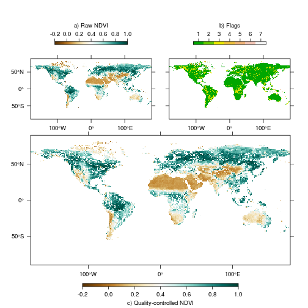

# Quality control

Using the default settings, `rasterizeGimms` creates proper `Raster*` objects from the ENVI binary images. Associated with each half-monthly NDVI<sub>3g</sub> dataset is a quality flag layer indicating the data reliability on a pixel basis. The flag values are as follows (taken from <http://ecocast.arc.nasa.gov/data/pub/gimms/3g.v0/00READMEgeo.txt>):
  
  Flag value      | <div align="left">Description</div>
    --------------- | -----------    
    1 and 2 | good value
  3 | value derived from spline interpolation
  4 | value derived from spline interpolation, possibly snow
  5 | value derived from average seasonal profile
  6 | value derived from average seasonal profile, possibly snow
  7 | missing value
  
Quality control can easily be carried out by invoking the function `qualityControl` which works both on binary files and already rasterized images. With regard to memory usage, however, we strongly advice to create NDVI and flag layers separately via `rasterizeGimms` (with `filename` provided) and use these as input for `qualityControl`.   


```r
ndvi <- rasterizeGimms(gimms_files[1])
flag <- rasterizeGimms(gimms_files[1], flag = TRUE)

qc <- qualityControl(ndvi, flag)
```


